# 后端计算与 Web 服务进程隔离 — 设计文档

> 日期: 2026-09-24  
> 范围: 将 GDAL 等长时 GIL 占用操作从 uvicorn 主进程移出,改用常驻 worker 进程池执行任务,实现 Web 服务响应与后台计算隔离、多任务并行。  
> 前置: 基于现状分析 — `TaskQueue` 单线程 worker 在主进程、GDAL 操作实测停顿最长 9.5s。

## 1. 问题与目标

### 现状

后端计算与 Web 服务**在同一个 uvicorn 主进程中**:

- **TaskQueue 的 worker 线程**在主进程内顺序消费任务队列(`core/queue.py:67` `_worker_loop`)。
- **GDAL 密集操作持有 GIL**,实测停顿时长:
  - `build_overviews`(金字塔): **8267ms**
  - `reproject_geotiff`: **9497ms**
  - `clip_to_geometry`: **4103ms**
  - `mosaic_to_geotiff` 逐行写瓦片: 53ms(正常)
  - OSM 切片循环(8 线程): 197ms(争抢,非硬卡死)
- 停顿期间 **FastAPI 请求全部阻塞** — 实测表现为前端操作无响应,必须等计算阶段完成。

**根因**: Python GIL(全局解释器锁)限制 — 即使 FastAPI 用协程,GDAL C 扩展占住 GIL 时其他线程无法执行。

### 目标

1. **隔离性**: Web 服务(FastAPI 接口 / WebSocket 推送)与后台计算(下载、GDAL 拼接、转换)运行在不同进程,计算停顿不影响 API 响应。
2. **多任务并行**: 支持多个任务同时执行(当前 `TaskQueue` 是单 worker 顺序消费)。
3. **资源可控**: worker 进程数可配置(默认 2),避免无限制并发耗尽内存/CPU。

### 非目标(本次不做)

- **任务优先级队列** — 所有任务 FIFO,无优先级调度。
- **动态扩缩容** — worker 数量启动后固定,不根据负载动态调整。
- **跨机分布式** — 仅单机多进程,不涉及网络分布式调度。

## 2. 核心设计决策

| # | 决策 | 理由 |
|---|---|---|
| D1 | **用 `multiprocessing.Process` + `Queue` 实现进程池** | 标准库方案,无额外依赖;与现有 `asyncio` 无冲突(队列在启动时创建,主循环通过 `asyncio.to_thread` 非阻塞读写)。 |
| D2 | **TaskQueue 改名为 Scheduler,职责变为「进程池 + 队列管理」** | 原名暗示"任务容器",新职责是"调度器";保留 `enqueue` 等公开接口,避免破坏 `api/` 调用。 |
| D3 | **worker 子进程从数据库读任务,而非序列化整个 task dict** | `emit` 闭包、provider 对象都不可 pickle;传 `task_id` 让子进程自己构造,保持进程边界干净。 |
| D4 | **进度通过 `multiprocessing.Queue` 回传,主进程广播给 WebSocket** | 与现有 `asyncio.Queue` 桥接:`Scheduler._event_consumer` 协程持续读 `event_queue`(用 `asyncio.to_thread` 包装 `.get()`),转投 `self._broadcast_queue`。 |
| D5 | **日志通过队列转发到主进程,由主进程统一输出** | 子进程的 `print` / `logging` 不可靠(可能丢失或乱序);自定义 `QueueHandler` 把日志事件投 `event_queue`,主进程解包后用根 logger 输出。 |
| D6 | **暂停/取消通过 `control_queue` 投递,worker 通过 `should_stop` 闭包检查** | 避免共享内存(`Manager.dict`);worker 轮询 `control_state` dict(进程内变量),主进程通过控制消息更新它。 |
| D7 | **改造分两阶段:阶段 1 建进程边界但 worker=1;阶段 2 放开并发** | 最小化风险 — 阶段 1 可先验证隔离效果且行为与单 worker 一致,阶段 2 再处理并发竞争(如 SQLite 并发写)。 |
| D8 | **PyInstaller 打包需加 `if __name__ == "__main__": freeze_support()`** | Windows 下 `multiprocessing` 用 spawn 模式,子进程会重新执行主模块;不加 `freeze_support()` 会无限递归创建子进程。 |

## 3. 整体架构

### 3.1 进程模型

```
┌─────────────────────────────────────────────────────────────┐
│ 主进程 (FastAPI + uvicorn)                                   │
│  ┌────────────────────────────────────────────────────────┐ │
│  │ Scheduler (原 TaskQueue)                               │ │
│  │  - 管理 N 个 worker 子进程                             │ │
│  │  - control_queue: 投递 run/pause/cancel/shutdown      │ │
│  │  - event_queue: 接收进度/日志/finished                │ │
│  │  - _event_consumer 协程: event_queue → broadcast_queue│ │
│  └────────────────────────────────────────────────────────┘ │
│  ┌────────────────────────────────────────────────────────┐ │
│  │ WebSocket (/ws/progress)                               │ │
│  │  - 从 broadcast_queue 读事件,推送给前端               │ │
│  └────────────────────────────────────────────────────────┘ │
└──────────────────┬──────────────────────────────────────────┘
                   │
                   │ multiprocessing.Queue (双向)
                   │
       ┌───────────┴───────────┬─────────────┬─────────────┐
       ▼                       ▼             ▼             ▼
  ┌─────────┐            ┌─────────┐   ┌─────────┐   ┌─────────┐
  │ Worker 1│            │ Worker 2│   │ Worker 3│...│ Worker N│
  │         │            │         │   │         │   │         │
  │  循环:  │            │  循环:  │   │  循环:  │   │  循环:  │
  │ 1.读msg │            │ 1.读msg │   │ 1.读msg │   │ 1.读msg │
  │ 2.查DB  │            │ 2.查DB  │   │ 2.查DB  │   │ 2.查DB  │
  │ 3.run   │            │ 3.run   │   │ 3.run   │   │ 3.run   │
  │ 4.emit→ │            │ 4.emit→ │   │ 4.emit→ │   │ 4.emit→ │
  │  queue  │            │  queue  │   │  queue  │   │  queue  │
  └─────────┘            └─────────┘   └─────────┘   └─────────┘
```

### 3.2 跨进程协议

#### 控制消息 (主进程 → worker)

通过 `control_queue: multiprocessing.Queue` 投递,worker 阻塞读取。

```python
# 消息类型
{"type": "run", "task_id": 123}       # 执行任务
{"type": "pause", "task_id": 123}     # 暂停任务(协作式)
{"type": "cancel", "task_id": 123}    # 取消任务(协作式)
{"type": "shutdown"}                  # 关闭 worker 进程
```

#### 事件消息 (worker → 主进程)

通过 `event_queue: multiprocessing.Queue` 投递,主进程的 `_event_consumer` 协程消费。

```python
# 消息类型
{"type": "event", "payload": {...}}   # 进度事件(与现有 emit 一致)
{"type": "log", "record": {...}}      # 日志记录(level/msg/timestamp/worker_id)
{"type": "finished", "task_id": 123}  # 任务结束(成功/失败/取消都发)
```

`payload` 格式与现有 `emit` 调用一致(如 `{"task_id": 123, "status": "running", "progress": 50}`)。

### 3.3 核心组件交互

```dot
digraph components {
    rankdir=LR;
    node [shape=box];
    
    "API /api/tasks" -> "Scheduler.enqueue(task_id)";
    "Scheduler.enqueue(task_id)" -> "control_queue.put(run)";
    "control_queue.put(run)" -> "Worker.control_loop()";
    "Worker.control_loop()" -> "db.get_task(task_id)";
    "db.get_task(task_id)" -> "runner.run_task()";
    "runner.run_task()" -> "emit(payload)";
    "emit(payload)" -> "event_queue.put(event)";
    "event_queue.put(event)" -> "Scheduler._event_consumer";
    "Scheduler._event_consumer" -> "broadcast_queue.put()";
    "broadcast_queue.put()" -> "WebSocket /ws/progress";
}
```



## 4. 详细设计

### 4.1 Scheduler (原 TaskQueue 改造)

**文件**: `backend/core/scheduler.py` (从 `queue.py` 重命名)

#### 初始化

```python
class Scheduler:
    def __init__(self, num_workers: int = 2):
        self._num_workers = num_workers
        self._control_queue = mp.Queue()  # 主进程 → worker
        self._event_queue = mp.Queue()    # worker → 主进程
        self._broadcast_queue = asyncio.Queue()  # 内部: event_consumer → ws
        self._workers: list[mp.Process] = []
        self._running_tasks: dict[int, int] = {}  # task_id -> worker_id
```

#### 启动与关闭

```python
def start(self):
    """启动 N 个 worker 子进程 + event_consumer 协程"""
    for i in range(self._num_workers):
        p = mp.Process(target=worker_main, 
                      args=(self._control_queue, self._event_queue, i))
        p.start()
        self._workers.append(p)
    
    # 启动事件消费协程(桥接 mp.Queue → asyncio.Queue)
    asyncio.create_task(self._event_consumer())

async def _event_consumer(self):
    """持续从 event_queue 读取,转投 broadcast_queue"""
    loop = asyncio.get_running_loop()
    while True:
        # mp.Queue.get() 是阻塞调用,用 to_thread 避免卡住事件循环
        msg = await loop.run_in_executor(None, self._event_queue.get)
        
        if msg["type"] == "finished":
            self._running_tasks.pop(msg["task_id"], None)
        
        # 转投 asyncio.Queue,供 WebSocket 消费
        await self._broadcast_queue.put(msg)

def shutdown(self):
    """关闭所有 worker"""
    for _ in self._workers:
        self._control_queue.put({"type": "shutdown"})
    for p in self._workers:
        p.join(timeout=10)
        if p.is_alive():
            p.terminate()
```

#### 公开接口(保持向后兼容)

```python
def enqueue(self, task_id: int):
    """投递任务到队列"""
    self._control_queue.put({"type": "run", "task_id": task_id})

def request_pause(self, task_id: int):
    """请求暂停任务(协作式,worker 需检查 should_stop)"""
    self._control_queue.put({"type": "pause", "task_id": task_id})

def request_cancel(self, task_id: int):
    """请求取消任务(协作式)"""
    self._control_queue.put({"type": "cancel", "task_id": task_id})

def subscribe(self) -> asyncio.Queue:
    """返回 broadcast_queue,供 WebSocket 订阅"""
    return self._broadcast_queue
```

### 4.2 Worker 进程

**文件**: `backend/core/worker.py` (新增)

#### 进程入口

```python
def worker_main(control_queue: mp.Queue, event_queue: mp.Queue, worker_id: int):
    """Worker 子进程入口"""
    # 1. 惰性导入(避免主进程 import 时的循环依赖)
    from backend import db, config
    from backend.core import runner, runner_3d, runner_buildings
    
    # 2. 设置日志转发
    _setup_logging(event_queue, worker_id)
    
    # 3. 控制状态(进程内变量,通过消息更新)
    control_state = {}  # task_id -> "paused" | "cancelled"
    
    def should_stop(task_id: int) -> bool:
        """供 runner 轮询的闭包"""
        return control_state.get(task_id) in ("paused", "cancelled")
    
    # 4. 主循环
    while True:
        msg = control_queue.get()  # 阻塞等待控制消息
        
        if msg["type"] == "shutdown":
            break
        
        elif msg["type"] == "run":
            task_id = msg["task_id"]
            _run_task(task_id, event_queue, should_stop)
        
        elif msg["type"] in ("pause", "cancel"):
            control_state[msg["task_id"]] = msg["type"] + "d"
```

#### 任务执行

```python
def _run_task(task_id: int, event_queue: mp.Queue, should_stop):
    """查数据库、调 runner、转发进度"""
    import traceback
    import time
    
    # 1. 查数据库
    with db.get_db_connection() as conn:
        task = db.get_task(conn, task_id)
    
    if not task:
        event_queue.put({
            "type": "log",
            "record": {"level": "ERROR", "msg": f"Task {task_id} not found", 
                      "timestamp": time.time()}
        })
        event_queue.put({"type": "finished", "task_id": task_id})
        return
    
    # 2. 构造 emit 闭包(转发进度到队列)
    def emit(payload: dict):
        event_queue.put({"type": "event", "payload": payload})
    
    # 3. 调用 runner
    try:
        pipeline = task.get("pipeline", "")
        if pipeline == "PIPE_3D":
            from backend.core import runner_3d
            runner_3d.run_3d_task(task_id, emit, should_stop)
        elif pipeline == "PIPE_BUILDINGS":
            from backend.core import runner_buildings
            runner_buildings.run_buildings_task(task_id, emit, should_stop)
        else:
            from backend.core import runner
            runner.run_task(task_id, emit, should_stop)
    except Exception:
        event_queue.put({
            "type": "log",
            "record": {"level": "ERROR", 
                      "msg": f"Task {task_id} failed:\n{traceback.format_exc()}",
                      "timestamp": time.time()}
        })
    finally:
        event_queue.put({"type": "finished", "task_id": task_id})
```

#### 日志转发

```python
import logging
from logging import LogRecord

class QueueHandler(logging.Handler):
    """把日志记录序列化后投到队列"""
    def __init__(self, queue: mp.Queue, worker_id: int):
        super().__init__()
        self.queue = queue
        self.worker_id = worker_id
    
    def emit(self, record: LogRecord):
        try:
            self.queue.put({
                "type": "log",
                "record": {
                    "level": record.levelname,
                    "msg": self.format(record),
                    "timestamp": record.created,
                    "worker_id": self.worker_id,
                }
            })
        except Exception:
            self.handleError(record)

def _setup_logging(event_queue: mp.Queue, worker_id: int):
    """子进程启动时调用,重定向所有日志到队列"""
    root = logging.getLogger()
    root.handlers.clear()  # 移除继承自父进程的 handler
    root.addHandler(QueueHandler(event_queue, worker_id))
    root.setLevel(logging.INFO)
```

### 4.3 Runner 改造

#### 签名变更

`core/runner.py::run_task` / `runner_3d.py::run_3d_task` / `runner_buildings.py::run_buildings_task`:

```python
# 旧签名
def run_task(task_id: int, emit: callable):
    ...
    if task_queue.control_of(task_id) == "paused":  # ← 直接访问全局单例
        break

# 新签名
def run_task(task_id: int, emit: callable, should_stop: callable):
    ...
    if should_stop(task_id):  # ← 通过闭包检查
        break
```

**改动点**:

- 移除 `from backend.core.queue import task_queue` 导入。
- 所有 `task_queue.control_of(task_id)` 改为 `should_stop(task_id)`(约 15 处)。
- 函数签名加 `should_stop` 参数。

### 4.4 配置

`backend/config.py` 新增字段:

```python
@dataclass
class Config:
    ...
    num_workers: int = 2  # Scheduler 进程池大小
```

`config.yaml`:

```yaml
num_workers: 2  # 并发任务数上限,建议 2-4(单任务已内部多线程)
```

环境变量覆盖: `NUM_WORKERS=4`。

### 4.5 主进程启动流程

`backend/main.py`:

```python
import multiprocessing as mp
from backend.core.scheduler import scheduler

if __name__ == "__main__":
    mp.freeze_support()  # PyInstaller 必须
    
    # uvicorn.run 前启动 scheduler
    scheduler.start()
    
    try:
        uvicorn.run(app, host="127.0.0.1", port=8000)
    finally:
        scheduler.shutdown()
```

## 5. SQLite 并发写处理

### 问题

SQLite 默认 `PRAGMA journal_mode=DELETE`,并发写会抛 `database is locked`。

### 解决方案

**WAL 模式** (Write-Ahead Logging):

```python
# backend/db.py::init_db()
conn.execute("PRAGMA journal_mode=WAL")
conn.execute("PRAGMA busy_timeout=5000")  # 锁等待 5s 后才报错
```

**效果**:

- 读写可并发(读不阻塞写)。
- 多个 worker 写入时按顺序排队,而非立即报错。
- 生成 `data.db-wal` / `data.db-shm` 文件(自动管理,无需手动清理)。

**迁移逻辑**:

```python
def ensure_wal_mode():
    """检查并切换为 WAL 模式(幂等)"""
    with get_db_connection() as conn:
        mode = conn.execute("PRAGMA journal_mode").fetchone()[0]
        if mode.lower() != "wal":
            conn.execute("PRAGMA journal_mode=WAL")
```

在 `init_db()` 后调用一次。

## 6. 错误处理

| 场景 | 处理 |
|---|---|
| Worker 子进程崩溃 | `Scheduler._event_consumer` 检测进程退出(通过 `p.is_alive()` 轮询),记录错误日志,**不自动重启**(避免无限崩溃循环);任务标记为 failed。 |
| 任务执行异常 | `_run_task` 的 `try-except` 捕获,用 `traceback.format_exc()` 转发完整堆栈到日志,发送 `finished` 消息,主进程更新任务状态为 failed。 |
| 队列满(理论上不会) | `mp.Queue` 无界,但若内存耗尽会抛 `MemoryError`;当前不处理(单机自用场景,任务数有限)。 |
| 关闭时仍有运行任务 | `shutdown()` 先投 N 个 `shutdown` 消息,等 10s;超时后 `terminate()` 强杀;数据库中残留 running 任务在下次启动时被 `reset_stale_running` 标记为 paused。 |
| WebSocket 断线重连 | 前端重连时,主进程从数据库读最新任务状态推送(与现有逻辑一致,无需改动)。 |

## 7. 测试策略

### 7.1 单元测试 (`tests/`)

| 文件 | 覆盖 |
|---|---|
| `test_scheduler.py` | `enqueue` → 控制消息格式正确;`shutdown` → 子进程退出;`_event_consumer` → 事件桥接到 broadcast_queue |
| `test_worker.py` | `worker_main` → 接收 run 消息、调用 runner、发送 finished;`should_stop` → 响应 pause/cancel 消息;异常时发送 log + finished |
| `test_queue_logging.py` | `QueueHandler` → 日志记录序列化正确、包含 worker_id |
| `test_runner_signature.py` | `run_task` 新签名接受 `should_stop`;调用 `should_stop(task_id)` 返回 True 时中断循环 |

所有测试用 `unittest.mock` 模拟队列与数据库,不启动真实子进程。

### 7.2 集成测试

**阶段 1 (单 worker 验证隔离)**:

1. 启动服务,`num_workers=1`。
2. 提交一个 GDAL 密集任务(如拼接大范围影像)。
3. 任务运行时,并发调用 `/api/tasks`(列表接口),确认响应时间 <100ms(不被阻塞)。
4. WebSocket 连接确认能实时收到进度。

**阶段 2 (多 worker 并发)**:

1. `num_workers=2`,提交两个任务(A、B)。
2. 确认任务状态同时为 `running`(而非 A 完成后 B 才开始)。
3. 确认 SQLite 无 `database is locked` 错误(WAL 模式生效)。
4. 一个任务执行中,暂停另一个任务,确认控制消息正确路由。

### 7.3 手工验证清单

1. 启动服务,提交任务 A(大范围下载),运行期间刷新任务列表 → 确认列表立即返回(不卡顿)。
2. 任务 A 运行期间,提交任务 B → 确认 A 和 B 同时执行(前端显示两个都在 running)。
3. 暂停任务 A → 确认 A 状态变 paused、B 继续运行。
4. 关闭服务(Ctrl+C)→ 确认 worker 进程正常退出(无僵尸进程)、下次启动时残留任务标记为 paused。
5. Windows 下用 PyInstaller 打包 → 确认 `freeze_support()` 生效、不会无限创建子进程。

## 8. 分期实施

### 阶段 1: 建立进程边界(单 worker,行为不变)

**目标**: 证明隔离有效,且单 worker 时行为与改造前一致。

**任务**:

1. 定义跨进程协议消息格式(`ControlMessage` / `EventMessage`)。
2. 实现 `worker.py::worker_main` 与控制循环。
3. 实现日志转发(`QueueHandler`)。
4. 改造 `runner.py` 等三个 runner 的签名,加 `should_stop` 参数。
5. `Scheduler` 初始化时固定 `num_workers=1`,实现 `enqueue` / `_event_consumer` / `shutdown`。
6. SQLite 切换 WAL 模式。
7. `main.py` 加 `freeze_support()`。
8. 集成测试:提交任务,确认隔离生效(API 不阻塞)、功能正确(成果与改造前一致)。

**验收标准**:

- 后端测试全绿(约 160+ 用例)。
- 集成测试:GDAL 密集任务运行时,`/api/tasks` 响应 <100ms。
- 前端测试全绿(约 85 用例)。

### 阶段 2: 放开并发(多 worker)

**目标**: 支持多任务并行。

**任务**:

1. 配置项 `num_workers` 默认值改为 2。
2. `Scheduler._event_consumer` 处理 `finished` 消息时更新 `_running_tasks` 映射。
3. 前端任务列表:多个任务同时显示 `running` 状态(后端已支持,前端只需确认显示正确)。
4. 集成测试:两个任务并发执行,确认无 SQLite 锁错误、两者进度独立更新。

**验收标准**:

- 提交两个任务,确认同时进入 `running`。
- 数据库日志无 `database is locked`。
- 暂停/取消其中一个任务,另一个不受影响。

## 9. 向后兼容性

| 组件 | 兼容性 | 说明 |
|---|---|---|
| API 接口 | **完全兼容** | `/api/tasks` 的请求/响应格式不变 |
| WebSocket | **完全兼容** | 进度消息格式不变(仍是 `emit` 的 payload) |
| 配置文件 | **新增字段** | `num_workers` 有默认值,旧配置文件不报错 |
| 数据库 | **无需迁移** | 只加 `PRAGMA`,表结构不变 |
| 前端 | **无需改动** | 任务列表/详情/WebSocket 订阅逻辑不变 |
| CLI | **影响最小** | `start.bat` 无需改(启动逻辑在 `main.py`) |

## 10. 性能预期

### 响应时间

| 场景 | 改造前 | 改造后 | 提升 |
|---|---|---|---|
| GDAL 密集任务运行时,调用 `/api/tasks` | **9+ 秒**(等待 GIL) | **<100ms** | **90×+** |
| 任务列表(无运行任务) | ~50ms | ~50ms | 无变化 |
| WebSocket 进度推送延迟 | ~100ms | ~100ms | 无变化 |

### 任务吞吐

| 场景 | 改造前 | 改造后(num_workers=2) | 提升 |
|---|---|---|---|
| 提交 3 个任务的总完成时间 | **T1 + T2 + T3**(串行) | **max(T1+T2, T3)**(2 并发) | **1.5×~2×** |

> T1、T2、T3 为单任务耗时;若任务时长接近,提升接近 2×。

### 资源占用

| 指标 | 改造前 | 改造后(num_workers=2) | 备注 |
|---|---|---|---|
| 内存 | ~300MB | ~500MB | 每个 worker 约 +100MB(加载 GDAL/rasterio) |
| CPU | 单核心 100% | 多核心各 50%(任务并行) | 实际利用率取决于任务 I/O 占比 |

## 11. 风险与缓解

| 风险 | 影响 | 缓解 |
|---|---|---|
| `multiprocessing` 在 PyInstaller 打包后行为异常 | 打包版无法启动 | 加 `freeze_support()`;打包后手工验证清单(第 7.3 节第 5 项) |
| SQLite WAL 模式在 NAS/网络盘失效 | 并发写报错 | 文档说明 WAL 需本地文件系统;错误提示引导用户迁移数据库到本地盘 |
| Worker 子进程内存泄漏(GDAL 未释放资源) | 长时间运行内存耗尽 | 阶段 1 观察单 worker 内存,若存在则加"执行 N 个任务后重启 worker"逻辑 |
| 队列消息积压(生产速度 > 消费速度) | 内存占用持续增长 | `event_queue` 理论无界,但实测单任务进度消息 <1KB/s,积压不明显;若出现则加队列长度监控 |

## 12. 未来扩展方向

本设计为以下需求预留扩展点(本次不实现):

1. **任务优先级**: `control_queue` 改为 `PriorityQueue`,消息加 `priority` 字段。
2. **动态扩缩容**: 监控队列长度,动态 `spawn` / `terminate` worker。
3. **资源限制**: 给 worker 加内存/CPU 限制(用 `resource` 模块或 cgroups)。
4. **跨机分布式**: 替换 `multiprocessing.Queue` 为 Redis/RabbitMQ,worker 可部署在其他机器。

当前设计(进程内队列 + 闭包控制)是这些扩展的基础,架构边界清晰便于后续替换。

---

**设计完成,等待评审。**
